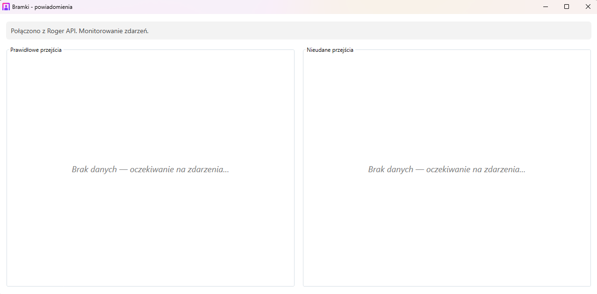
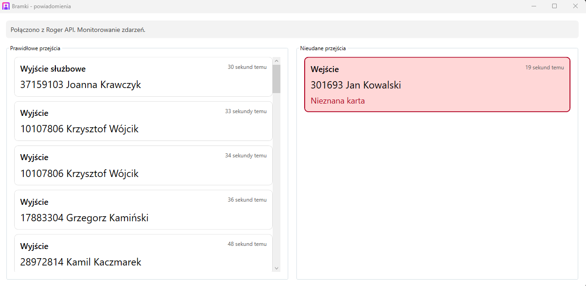
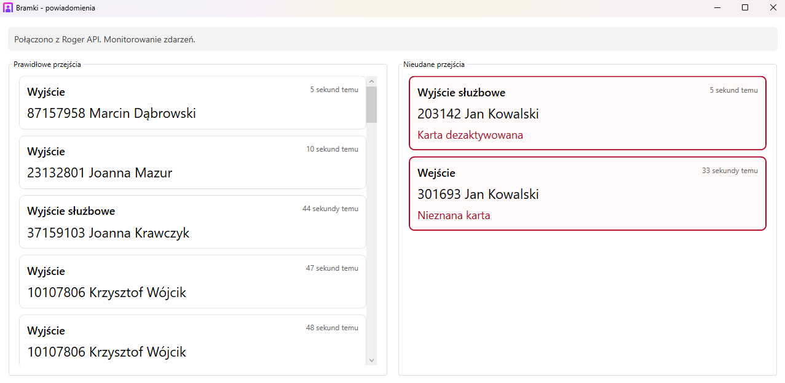

# Bramki Notify

A lightweight **WPF tray application** that monitors access-control events from an external API and shows a live feed of **successful** and **denied** passages.  
Designed to run quietly in the background, notify on problems, and optionally start with Windows.

---

## Key Features

- Live monitoring of access events (polling loop)
- Two event streams:
  - ✅ *Prawidłowe przejścia* (regular / successful)
  - ❌ *Nieudane przejścia* (denied / problems)
- Attention mode for denied events:
  - sound notification (`SystemSounds.Exclamation`)
  - taskbar flash
  - pulsing highlight animation until acknowledged
- Minimize to tray (closing hides the window)
- Single-instance behavior (second run brings the existing window to front)
- Start with Windows toggle (per-user) via registry `HKCU\...\Run`
- Friendly timestamps:
  - exact time on hover
  - relative time in Polish (“przed chwilą”, “5 minut temu”, …)

---

## Tech Stack

- .NET (WPF)
- Windows Tray Icon (`NotifyIcon`)
- Windows Registry startup entry (`HKCU\Software\Microsoft\Windows\CurrentVersion\Run`)
- WCF Connected Services clients (BasicHttpBinding)

---

## UI Overview

The main window contains:
- Status line showing connection state
- Left panel: regular events
- Right panel: denied events (highlighted when requires attention)

Denied events pulse using a globally shared animated brush (`AttentionPulseBrush`) so all highlighted items “breathe” in sync.

---

## Project Structure

    Bramki_Notify/
     ├── Assets/
     │    └── app.ico
     ├── Connected Services/
     │    ├── Bramki_Notify.SessionManagement/
     │    ├── Bramki_Notify.ConfigurationQuery/
     │    └── Bramki_Notify.EventLogManagement/
     ├── App.xaml
     ├── App.xaml.cs
     ├── MainWindow.xaml
     ├── MainWindow.xaml.cs
     ├── MainViewModel.cs
     ├── EventViewModel.cs
     ├── RelativeTimeConverter.cs
     ├── StartupManager.cs
     └── BramkiApiMonitor.cs

---

## How It Works

1. App starts and optionally stays hidden if launched with `--autostart`.
2. A tray icon is created with context menu:
   - **Uruchamiaj z Windows**
   - **Otwórz**
   - **Zakończ**
3. The app connects to the API and starts monitoring:
   - connects via SessionManagement
   - reads configuration via ConfigurationQuery (for person resolution)
   - polls EventLogManagement for new log entries
4. New events are mapped into view-model items and inserted at the top of lists:
   - `RegularEvents` (max 50)
   - `DeniedEvents` (max 50)
5. On denied event:
   - plays sound
   - flashes taskbar
   - highlights item until the user focuses the window (auto-ack after 3s)

Connection retries use exponential backoff (2s → 5s → 10s → … up to 60s).

---

## Configuration (Important)

This project contains placeholders in code for the API connection.

**In `App.xaml.cs`:**  
- private const string ApiBaseUrl = "http://API_Server_Address";  
- private const string ApiLogin = "API_Login";  
- private const string ApiPassword = "API_Password";  

---

## Running

### Requirements
- Windows 10/11
- .NET Desktop Runtime (matching your target framework)

### Start
- Run normally: shows UI
- Run minimized (autostart mode):  
  `Bramki_Notify.exe --autostart`

---

## Startup with Windows

The tray menu includes a toggle that writes to:

`HKCU\Software\Microsoft\Windows\CurrentVersion\Run`

- Value name: `BramkiPowiadomienia`
- Value data: `"path\to\exe" --autostart`

---

## Notes

- The app is **single-instance**. Launching it again signals the running instance to show the window.
- Person resolution is cached by `PersonID` to reduce API calls.
- Access point labels and controller id are configured in code (see `BramkiApiMonitor`).

---

## Future Improvements

- Move all constants (controller id, access points, API creds) to config
- Add log file output and optional verbose mode
- Pagination / virtualization for very active event streams
- Export events to CSV
- Add toast notifications (Windows notifications) instead of only sound + flashing

---

## Screenshots

